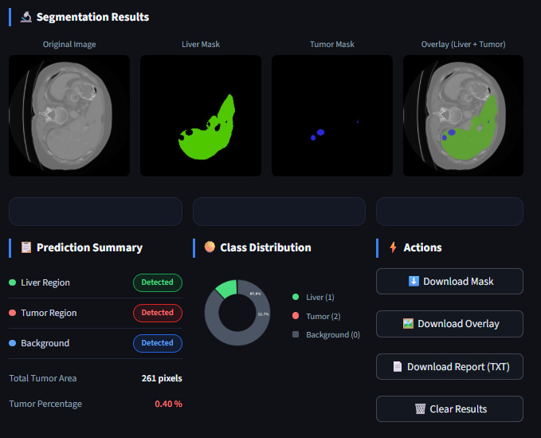

# 🫀 Liver Tumor Segmentation System Using DeepLabV3+

## 🌐 Live Web App

👉 [Open Live Demo](https://liver-tumor-segmentation-system.streamlit.app)

AI-powered medical image segmentation system for automatic **Liver Region** and **Tumor Region** detection from CT scan images using **DeepLabV3+ with ResNet34 backbone**.

This project provides an end-to-end pipeline including:

- 📦 3D CT Scan preprocessing into 2D slices  
- 🧠 Deep Learning model training  
- 📈 Validation & evaluation  
- 🔍 Prediction on unseen scans  
- 🌐 Premium Streamlit Web Interface  
- 📄 Downloadable reports & masks  

---

# 📷 Application

<p align="center">
  
</p>

---

# 📌 Project Overview

Liver cancer and tumor diagnosis from CT imaging is time-consuming and requires expert radiologists.  
This system helps automate segmentation of:

✅ Background  
✅ Liver Region  
✅ Tumor Region  

Using semantic segmentation, the model highlights infected regions for faster clinical analysis.

---

# 🚀 Key Features

### 🧠 Deep Learning Model

- DeepLabV3+
- ResNet34 Encoder
- Multi-class Segmentation (3 Classes)

### 🖥️ Web Application (Streamlit UI)

- Upload CT scan image
- Automatic model loading
- Liver mask generation
- Tumor mask generation
- Overlay visualization
- Confidence metrics
- Download results

### 📊 Analytics

- Tumor pixel area
- Tumor percentage
- Class distribution chart
- Prediction summary

---

# 🧪 Tech Stack

| Category | Technology |
|--------|------------|
| Language | Python |
| Deep Learning | PyTorch |
| Segmentation | segmentation-models-pytorch |
| Image Processing | OpenCV |
| Visualization | Matplotlib |
| Frontend | Streamlit |
| Dataset Handling | NumPy / PIL |

---

# 📂 Project Structure

```bash
Liver-Tumor-Segmentation-System/
│── assets/
│   └── result.png
│
│── src/
│   ├── models/
│   │   └── liver_best_model.pth
│   ├── app.py
│   ├── train.ipynb
│   ├── predict.ipynb
│   ├── validation.ipynb
│   ├── view_data.ipynb
│   └── Preprocess_3D_To_2D.ipynb
│
│── processed_data/
│── Liver_Dataset/
│── requirements.txt
│── README.md